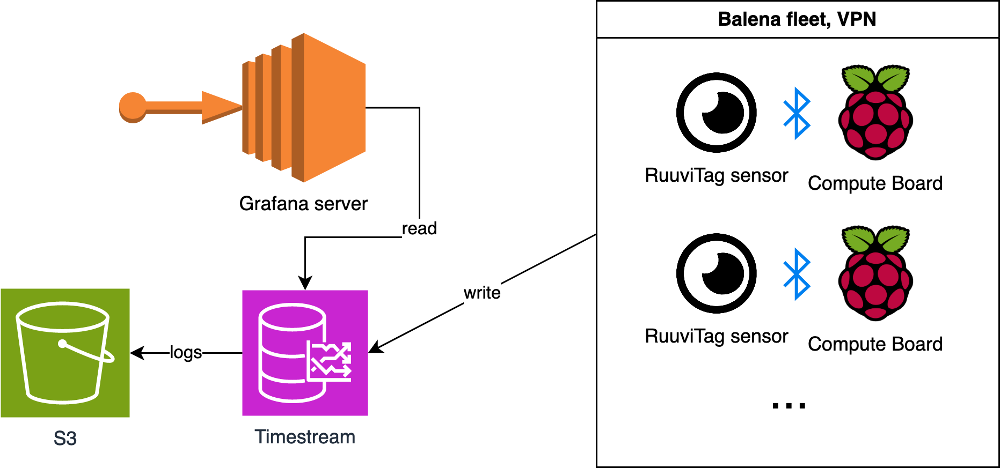

# ruuvitag
A ruuvitag is a weatherproof, battery powered sensor which reports temperature, humidity, pressure and motion via Bluetooth Low Energy (BLE) beacons. This repo shows how to define Ruuvitags to listen and write their values to AWS Timestream. The system is scalable by utilizing Balena fleet. Setting up the AWS side is left for the reader.



## Deploy
[](https://dashboard.balena-cloud.com/deploy?repoUrl=https://github.com/ahtonen/ruuvitag)

Just click the button, create or sign-in to your balenaCloud account, add and configure your device and start sending Ruuvitag data.

## Balena fleet and device configuration
Easiest way to prepare for scaling is to setup environment variables that are shared between devices as fleet variables:
```
AWS_ACCESS_KEY_ID
AWS_REGION
AWS_SECRET_ACCESS_KEY
AWS_WRITE_INTERVAL
DATABASE
TABLE
```
In addition you need to define following environment variables for each device:
```
COUNTRY
CITY
PLACE
RUUVITAG_MAC_ALIASES
```
First three are defined as *attributes* in AWS Timestream. Last variable binds finally Ruuvitag MAC to location like this:
```
RUUVITAG_MAC_ALIASES={'ED:BD:47:DA:64:D4': 'sauna', 'C9:50:B1:7D:A8:8F': 'balcony'}
```
Location is the last of total 4 unique attributes for each AWS record.

## Hardware required
* Raspberry Pi or balenaFin (see [supported devices](#supported-devices) )
* [Ruuvitag](https://shop.ruuvi.com/product/ruuvitag-1-pack/)(s)

## Software required
* A free [balenaCloud account](https://dashboard.balena-cloud.com/signup) (first ten devices are free and fully-featured, no credit card needed to start)
* A tool to flash OS images to SD cards, like [balenaEtcher](https://www.balena.io/etcher/)

## Supported devices
This project *has been tested to work* on the following devices:

| Device Type  | Status |
| ------------- | ------------- |
| Raspberry Pi 3b+ (64-bit OS) | ✔ |
